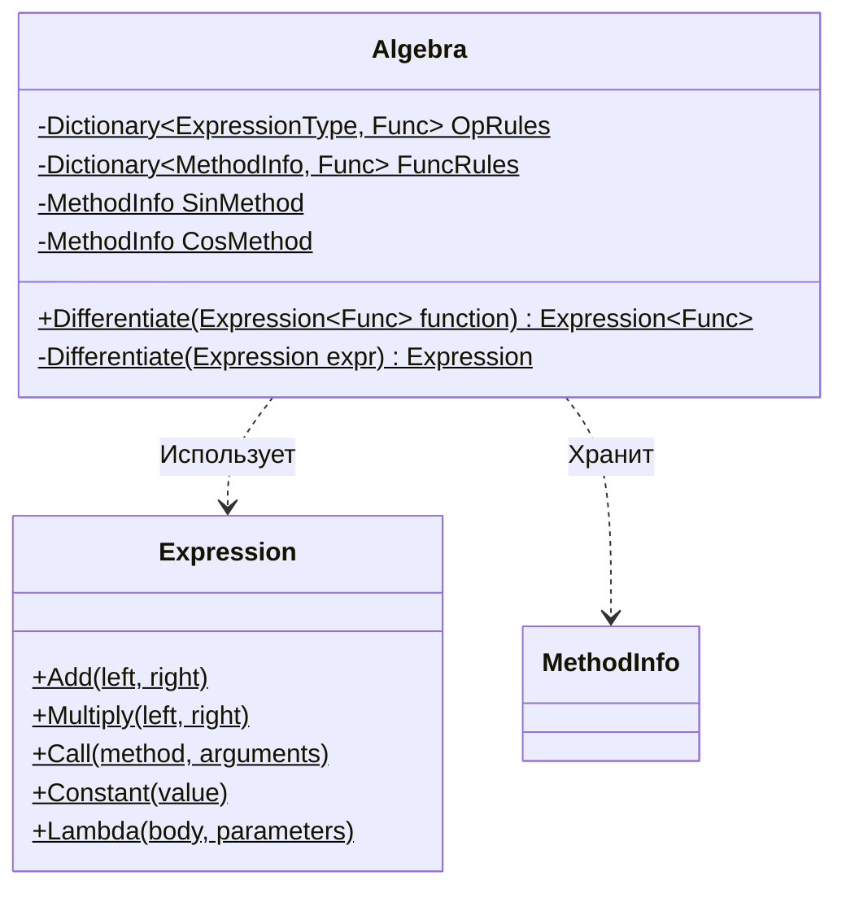

# Практика: Дифференцирование

## 1. Описание предметной области и сущностей

Было выполнено упражнение по реализации системы символьного (не численного) диф.-я мат.-х выражений при использовании LINQ Expressions.

## 2. Диаграмма классов (Mermaid)

