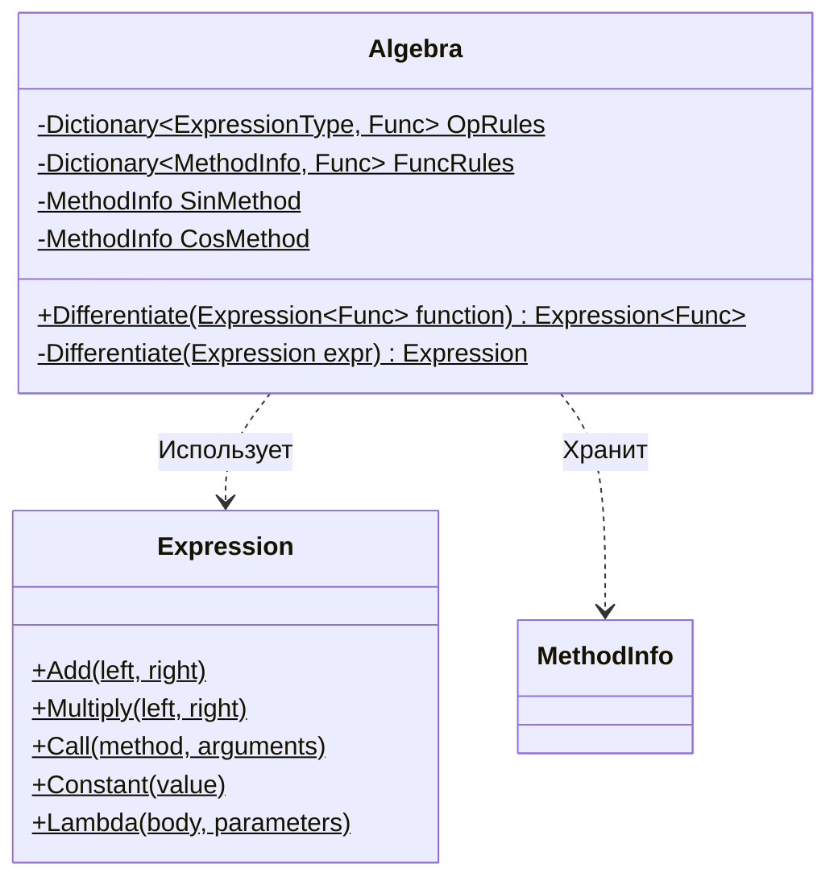

# Практика: Дифференцирование

## 1. Описание предметной области и сущностей

Выполнено упражнение по реализации системы символьного дифференцирования математических выражений на основе библиотеки System.Linq.Expressions. С использованием современного механизма сопоставления шаблонов (Pattern Matching) была построена рекурсивная обработка узлов дерева выражений для правил сложения, умножения, синуса и косинуса, а также настроена информативная обработка исключений ArgumentException для нестроковых или неподдерживаемых операций.

## 2. Диаграмма классов (Mermaid)

