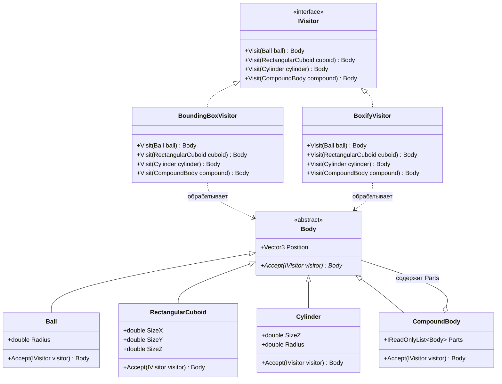

# Практика: Геометрия-2

## 1. Описание предметной области и сущностей

В данной практике релизуется шаблон Visitor, позволяющий добавлять в программу новые операции, не изменяя классы тех объектов, над которыми эти операции выполняются.
Через интерфейс IVisitor написаны два обработчика: BoundingBoxVisitor (считает габариты фигуры) и BoxifyVisitor (превращает фигуры в параллелепипеды). Метод Accept внутри фигур принимает объект посетителя и вызывает нужное действие.

## 2. Диаграмма классов (Mermaid)

