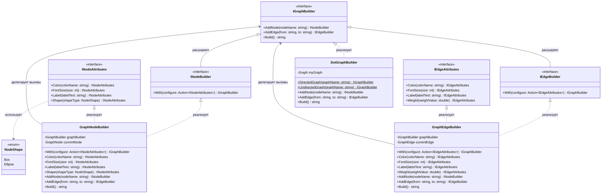

# Практика: GraphViz

## 1. Описание предметной области и сущностей

Проведено упражнение на проектирование Fluent API (текучего интерфейса) на базе паттерна Builder. Было применено разделение интерфейсов и лямбда-контексты With(), чтобы перенести проверки ограничений DOT-формата на уровень компиляции.

## 2. Диаграмма классов (Mermaid)

