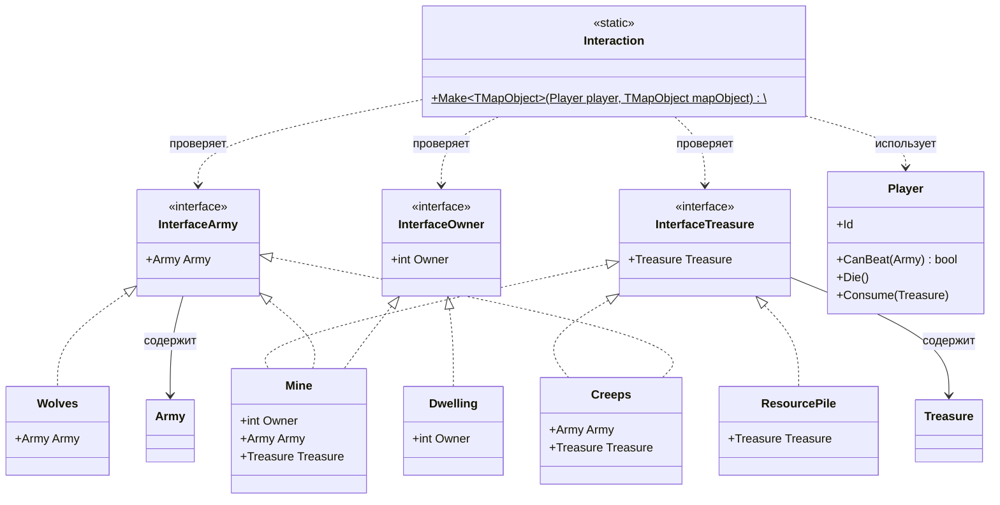

# Практика: HoMM

## 1. Описание предметной области и сущностей

Программа реализует поведение персонаж игрока и взаимодействует с различными объектами на карте. Всего существует три способа взаимодействия: 
* Сражаться с армией — проверка сил игрока против охраны объекта.
* Собирать сокровища — получение ресурсов или наград, находящихся внутри объекта.
* Присваивать объект себе — смена текущего владельца объекта на ID игрока.

## 2. Диаграмма классов (Mermaid)

