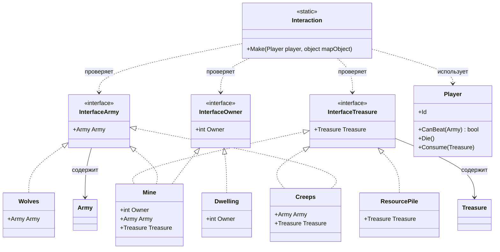

# Практика: HoMM

## 1. Описание предметной области и сущностей

(заполнить)

## 2. Диаграмма классов (Mermaid)

```mermaid

classDiagram
    %% Интерфейсы
    class InterfaceOwner {
        <<interface>>
        +int Owner
    }
    class InterfaceArmy {
        <<interface>>
        +Army Army
    }
    class InterfaceTreasure {
        <<interface>>
        +Treasure Treasure
    }

    %% Классы карты
    class Dwelling {
        +int Owner
    }
    class Mine {
        +int Owner
        +Army Army
        +Treasure Treasure
    }
    class Creeps {
        +Army Army
        +Treasure Treasure
    }
    class Wolves {
        +Army Army
    }
    class ResourcePile {
        +Treasure Treasure
    }

    %% Реализация интерфейсов
    InterfaceOwner <|.. Dwelling
    InterfaceOwner <|.. Mine
    InterfaceArmy <|.. Mine
    InterfaceTreasure <|.. Mine
    InterfaceArmy <|.. Creeps
    InterfaceTreasure <|.. Creeps
    InterfaceArmy <|.. Wolves
    InterfaceTreasure <|.. ResourcePile

    %% Внешние сущности (типы данных)
    class Army
    class Treasure
    class Player {
        +Id
        +CanBeat(Army) bool
        +Die()
        +Consume(Treasure)
    }

    %% Ассоциации свойств
    InterfaceArmy --> Army : содержит
    InterfaceTreasure --> Treasure : содержит

    %% Статический класс логики
    class Interaction {
        <<static>>
        +Make(Player player, object mapObject)
    }

    %% Зависимости метода Make
    Interaction ..> Player : использует
    Interaction ..> InterfaceArmy : проверяет
    Interaction ..> InterfaceOwner : проверяет
    Interaction ..> InterfaceTreasure : проверяет
    
```