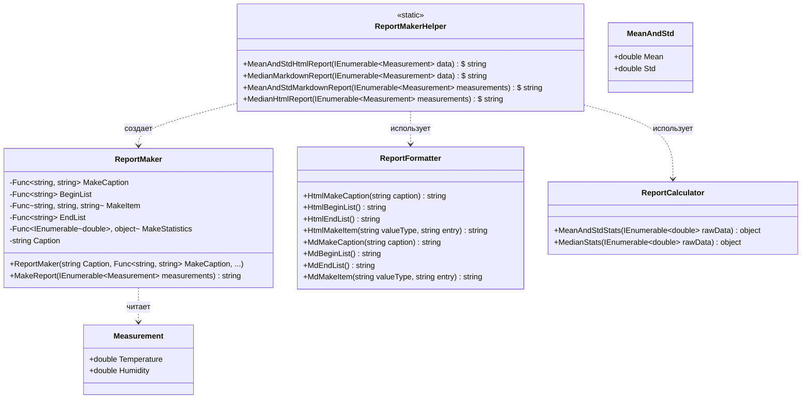

# Практика: Генератор отчетов

## 1. Описание предметной области и сущностей

В ходе рефакторинга логика формирования отчетов была заменена на делегирование через функциональные типы. Это позволило передавать правила оформления текста и методы расчета статистики в качестве параметров, разделив логику генерации структуры отчета и логику его конкретного наполнения.

---

## 2. Диаграмма классов (Mermaid)

