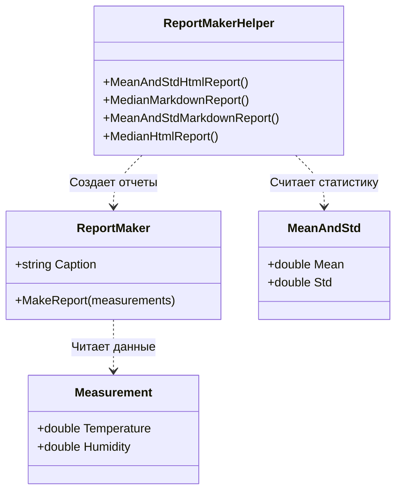

# Практика: Генератор отчетов

## 1. Описание предметной области и сущностей

(заполнить)

## 2. Диаграмма классов (Mermaid)

```mermaid

classDiagram
    class ReportMaker {
        +string Caption
        +MakeReport(measurements)
    }

    class ReportMakerHelper {
        +MeanAndStdHtmlReport()
        +MedianMarkdownReport()
        +MeanAndStdMarkdownReport()
        +MedianHtmlReport()
    }

    class Measurement {
        +double Temperature
        +double Humidity
    }

    class MeanAndStd {
        +double Mean
        +double Std
    }

    ReportMakerHelper ..> ReportMaker : Создает отчеты
    ReportMaker ..> Measurement : Читает данные
    ReportMakerHelper ..> MeanAndStd : Считает статистику
    
```
