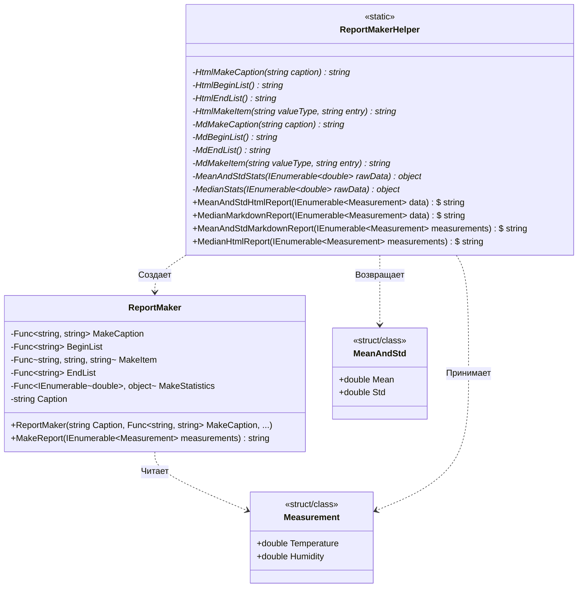

# Практика: Генератор отчетов

## 1. Описание предметной области и сущностей

Данная система представляет собой **компонент автоматической генерации отчетов** на основе результатов измерений. Архитектура построена на базе делегатов (`Func<...>`), что позволяет динамически менять формат вывода (HTML или Markdown) и алгоритм расчета статистических показателей без изменения основного класса генератора.

### Сущности системы:
*   **`Measurement`** — класс/структура данных, представляющая одиночное измерение. Хранит базовые показатели окружающей среды: температуру (`Temperature`) и влажность (`Humidity`).
*   **`MeanAndStd`** — объект-контейнер для хранения вычисленных статистических результатов: среднего арифметического значения (`Mean`) и стандартного отклонения (`Std`).
*   **`ReportMaker`** — основной движок генерации. Он содержит в себе структуру отчета (заголовок, начало списка, элементы, конец списка), но делегирует конкретное форматирование строк и расчеты внешним функциям.
*   **`ReportMakerHelper`** — статический класс-фабрика. Содержит готовые наборы приватных методов для разметки (HTML/Markdown) и математических расчетов (медиана, среднее и отклонение). Предоставляет публичные методы для быстрой сборки конкретных видов отчетов.

---

## 2. Диаграмма классов (Mermaid)

