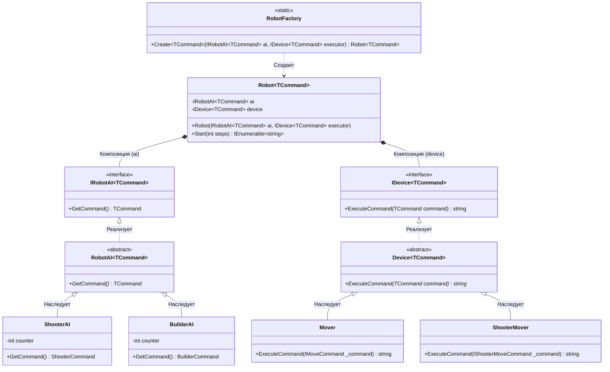

# Практика: Роботы

## 1. Описание предметной области и сущностей

Проведено упражнение на ковариацию и контравариацию. Были применены обобщенные Generics интерфейсы, чтобы архитектура стала строго типизированной.

## 2. Диаграмма классов (Mermaid)

