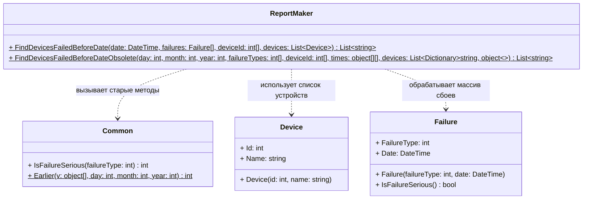

# Практика: Сбои

## 1. Описание предметной области и сущностей

Программа выводит список устройств, в которых до определенной даты случились критические сбои.

Device — Устройство с параметрами ID и Name
Failure — нужен для регистрации факта поломки. Он хранит код типа ошибки (`FailureType`) и точное время, когда она случилась (`Date`). Также он сам умеет определять, является ли сбой серьезным (`IsFailureSerious()`).
Common — вспомогательный класс из старой версии программы. Он нужен для обратной совместимости, так как содержит старые функции для проверки критичности ошибок по их коду и для ручного сравнения дат по дням, месяцам и годам.
ReportMaker — центральный класс, который собирает всю логику вместе. Он нужен, чтобы принять новые списки объектов (`Device` и `Failure`), правильно перегнать их данные в старые форматы (массивы и словари) и отфильтровать названия тех устройств, которые сломались раньше указанного срока.
## 2. Диаграмма классов (Mermaid)

