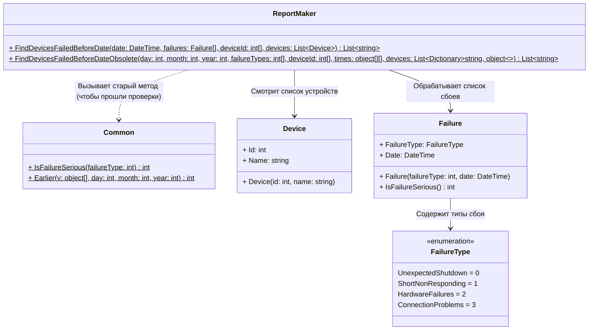

# Практика: Сбои

## 1. Описание предметной области и сущностей

Программа выводит список устройств, в которых до определенной даты случились критические сбои.

## 1. Диаграмма классов

```mermaid
classDiagram
    class FailureType {
        <<enumeration>>
        UnexpectedShutdown = 0
        ShortNonResponding = 1
        HardwareFailures = 2
        ConnectionProblems = 3
    }

    class Common {
        + IsFailureSerious(failureType: int) int$
        + Earlier(v: object[], day: int, month: int, year: int) int$
    }

    class Device {
        + Id: int
        + Name: string
        + Device(id: int, name: string)
    }

    class Failure {
        + FailureType: FailureType
        + Date: DateTime
        + Failure(failureType: int, date: DateTime)
        + IsFailureSerious() int
    }

    class ReportMaker {
        + FindDevicesFailedBeforeDate(date: DateTime, failures: Failure[], deviceId: int[], devices: List~Device~) List~string~$
        + FindDevicesFailedBeforeDateObsolete(day: int, month: int, year: int, failureTypes: int[], deviceId: int[], times: object[][], devices: List~Dictionary~string, object~~) List~string~$
    }

    %% Связи и подписи в точности как на твоем скриншоте + связь с enum
    ReportMaker ..> Common : Вызывает старый метод (чтобы прошли проверки)
    ReportMaker --> Device : Смотрит список устройств
    ReportMaker --> Failure : Обрабатывает список сбоев
    Failure --> FailureType : Содержит типы сбоя
```
