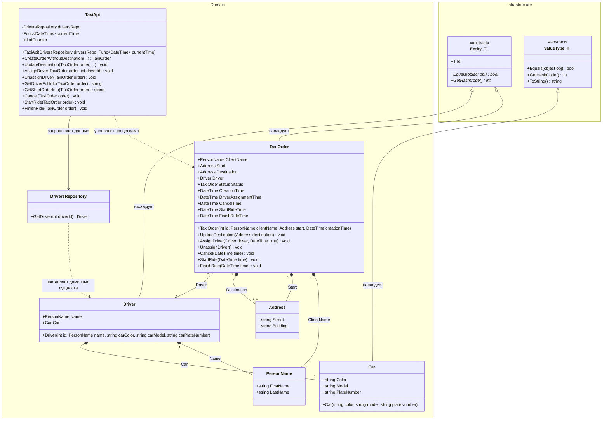

# Практика: TaxiOrder

## 1. Описание предметной области и сущностей

Система управления заказами такси построена на принципах DDD. В рамках задания выполнена переработка анемичной модели в богатую (Rich) доменную модель. Вся бизнес-логика и проверки инкапсулированы внутри доменных объектов, а технические детали и работа с данными вынесены в инфраструктурные компоненты.

## 2. Диаграмма классов (Mermaid)

